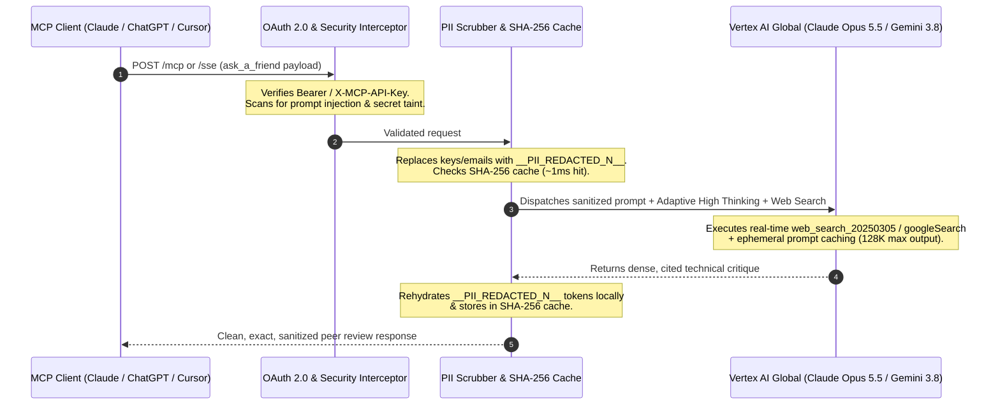

<p align="center">
  
</p>

<h1 align="center">Ask-a-Friend MCP</h1>

<p align="center">
  <strong>why get stuck when a specialized frontier friend can help — over MCP?</strong>
</p>

<p align="center">
  <a href="https://github.com/mbettan/ask-a-friend-mcp/stargazers"></a>
  <a href="https://github.com/mbettan/ask-a-friend-mcp/commits/main"></a>
  <a href="LICENSE"></a>
  <a href="https://modelcontextprotocol.io"></a>
  <a href="https://cloud.google.com/run"></a>
</p>

<p align="center">
  <a href="#before--after">before/after</a> •
  <a href="#deploy">deploy</a> •
  <a href="#connect-clients">connect clients</a> •
  <a href="#what-you-get">what you get</a> •
  <a href="#how-it-works">how it works</a> •
  <a href="#vertex-ai-org-policies">org policies</a>
</p>

---

A cloud-hosted **Model Context Protocol (MCP)** server on **Google Cloud Run** that lets any AI agent (**Claude Web & Desktop**, **Claude Code CLI**, **ChatGPT**, **Cursor IDE**, **Gemini / Antigravity CLI**) phone a specialized frontier model on **Google Vertex AI (`global`)** — powered by **Anthropic Claude Opus 5.5 (`opus-5-5`, 128K output, Adaptive High Thinking, Real-Time Web Search, 1M Context)** and **Google Gemini 3.8 Flash (`HIGH` Thinking + Google Search Grounding)** — with built-in PII scrubbing, prompt injection defense, and SHA-256 + ephemeral caching.

---

## Before / after

<table>
<tr>
<td width="50%">

### 🗣️ Raw single-agent loop (vulnerable & tunnel-visioned)

> Agent retries the same bug in a single-model echo chamber or sends raw credentials and unredacted code straight to external APIs:
> * 🔓 Raw secrets (`sk-ant-...`, `AKIA...`, emails) sent in plain text
> * 🧠 Single-model blind spots on subtle concurrency, security, or tax/math edge cases
> * 📅 Stale training cutoffs without live CVE or SDK doc verification
> * 💸 Identical prompts re-sent over the wire during iterative debugging

</td>
<td width="50%">

### 🔒 Secure `ask-a-friend` MCP call (sanitized, live-grounded, & cached)

> A dedicated FastMCP proxy scrubs sensitive identifiers pre-transit, grounds answers with live web search, and caches deterministically:
> * 🛡️ **Pre-transit PII scrubbing** replaces secrets with placeholders (`__PII_REDACTED_1__`) and rehydrates locally
> * 🔬 **Adaptive High Thinking + Live Web Search** (`opus-5-5` & `gemini-3.8-flash`)
> * ⚡ **Dual-layer caching** (`~1ms` SHA-256 local cache + `~90%` cheaper Vertex AI Ephemeral Prompt Cache)
> * 🔄 **Resilient multi-provider failover** across Anthropic and Google GenAI

</td>
</tr>
</table>

**Cross-model peer review. Live web grounding. Zero credential leakage.**

```
┌────────────────────────────────────────────────────────┐
│  pre-transit PII scrubbing  ██████ 100% (__PII_REDACTED)│
│  adaptive thinking effort   ██████ HIGH (128K output)  │
│  real-time web search       ██████ Brave + Google      │
│  prompt cache savings       ██████ ~1ms SHA256 / -90% $│
│  provider failover ladder   ██████ Opus 5.5 ➔ Gemini 3.8│
└────────────────────────────────────────────────────────┘
```

---

## Deploy

### 1-Command Google Cloud Run Deployment

Deploy your own private, serverless MCP instance on Google Cloud Run in one command:

```bash
chmod +x deploy.sh
./deploy.sh <YOUR_GCP_PROJECT_ID>
```

*What `deploy.sh` automates:*
1. Enables required GCP APIs (`run`, `aiplatform`, `secretmanager`, `cloudbuild`, `artifactregistry`, `orgpolicy`).
2. Configures Vertex AI Organization Policies (`vertexai.allowedPartnerModelFeatures` & `vertexai.allowedModels`) so Anthropic Web Search and Model Garden partner models work out-of-the-box.
3. Provisions a least-privilege runtime Service Account (`roles/aiplatform.user`, `roles/secretmanager.secretAccessor`).
4. Generates and stores your `MCP_API_KEY` (`aaf_...`) in Google Cloud Secret Manager (`mcp-api-key`).
5. Builds and deploys the pure MCP server container (`docs/` excluded via `.gcloudignore` / `.dockerignore`) to Cloud Run.

Retrieve your generated `MCP_API_KEY` anytime:
```bash
gcloud secrets versions access latest --secret=mcp-api-key --project=<YOUR_GCP_PROJECT_ID>
```

---

## Connect clients

### 1. Claude Custom Connector (Claude Web & Claude Desktop UI)
1. Open **Settings &rarr; Connectors &rarr; Add custom connector**.
2. Fill in the connector modal:
   - **Name:** `ask-a-friend`
   - **MCP server URL:** `https://your-cloud-run-url.run.app/mcp`
3. Click **Continue** — Claude auto-discovers the server's OAuth 2.0 and transport settings:
   - **Authentication:** Keep **Sign in now** (`Detected`) selected.
   - **OAuth client:** Keep **Register automatically** (`Detected` via RFC 7591) selected.
   - **Advanced &rarr; Transport:** Keep **Streamable HTTP** selected.
4. Click **Add / Connect**, paste your `MCP_API_KEY` into the **🤝 Ask-a-Friend MCP** authorization window, and click **Authorize Client &rarr;**.

### 2. Claude Code CLI (`claude`)
Register the remote Streamable HTTP MCP server across all workspaces (`--scope user`):
```bash
claude mcp add --scope user --transport http ask-a-friend \
  https://your-cloud-run-url.run.app/mcp \
  --header "X-MCP-API-Key: YOUR_MCP_API_KEY"
```
Verify inside Claude Code with `claude mcp list` or `/mcp`.

### 3. ChatGPT Native MCP Connector (SSE + OAuth 2.0)
- **Name:** `Ask-a-Friend`
- **Server URL:** `https://your-cloud-run-url.run.app/sse`
- **Authentication:** `OAuth` *(Auto-negotiated via RFC 7591 Dynamic Client Registration)*

### 4. ChatGPT Custom GPT Action (OpenAPI 3.1.0 REST)
- **Import Schema URL:** `https://your-cloud-run-url.run.app/openapi.yaml`
- **Authentication:** `API Key` &rarr; `Bearer` &rarr; `<YOUR_MCP_API_KEY>`

### 5. Cursor IDE (`.cursor/mcp.json`) & Gemini CLI (`~/.gemini/settings.json`)
```json
{
  "mcpServers": {
    "ask-a-friend": {
      "url": "https://your-cloud-run-url.run.app/mcp",
      "headers": {
        "X-MCP-API-Key": "YOUR_MCP_API_KEY"
      }
    }
  }
}
```

---

## Use

Once connected, your agent can consult a friend through natural language or explicit MCP tool invocations:

```text
"Ask a friend (opus-5-5) to audit this JWT verification middleware for timing leaks and recent CVEs."
"Use ask_a_friend with task_type='spec_critique' to find race conditions in our Redis cache invalidation design."
"Call ask_a_friend with friend_model='gemini-3.8-flash' and task_type='build_tests' to write pytest-asyncio edge cases."
```

---

## What you get

### Default Model Capabilities (Enabled Out-of-the-Box)

| Model Alias | Vertex AI Target (`global`) | Enabled Default Features | Max Output |
|---|---|---|---|
| `opus-5-5` *(Default)* | `claude-opus-5-5` | **Adaptive Thinking (`effort="high"`)**, **Real-Time Web Search (`web_search_20250305`)**, **Ephemeral Prompt Caching (`cache_control`)**, **1M Token Context (`context-1m-2025-08-07`)** | `128,000` tokens |
| `sonnet-5` | `claude-sonnet-5` | **Adaptive Thinking (`effort="high"`)**, **Real-Time Web Search**, **Ephemeral Prompt Caching**, **1M Token Context** | `128,000` tokens |
| `gemini-3.8-flash` / `gemini-pro` | `gemini-3.8-flash` | **`HIGH` Thinking (`thinking_level="HIGH"`)**, **Google Search Grounding (`googleSearch`)**, **URL Context (`urlContext`)**, automatic provider failover | `65,536` tokens |
| `gemini-3.5-flash-lite` | `gemini-3.5-flash-lite` | Ultra-low-latency analytical inference & lightweight verification | `65,536` tokens |

### Architecture & Pipeline Components

| Component | Module | Description |
|---|---|---|
| **Dual-Transport FastMCP** | [`src/server.py`](src/server.py) | Exposes `ask_a_friend` & `list_friends` tools, `askfriend://` resources, and prompts over `/mcp` (Streamable HTTP), `/sse` (SSE), and `/api/v1/` (REST). |
| **OAuth 2.0 & Auth Guard** | [`src/auth.py`](src/auth.py) | RFC 7591 Dynamic Client Registration, PKCE, HMAC-SHA256 stateless tokens, and constant-time (`secrets.compare_digest`) API key validation. |
| **Security & Taint Interceptor** | [`src/interceptor.py`](src/interceptor.py) | Blocks inbound prompt injection attempts and tracks secret taint to guarantee no raw secret escapes outbound. |
| **Pre-Transit PII Scrubber** | [`scripts/pii.py`](scripts/pii.py) | Regex scrubber that replaces API keys, AWS credentials, Bearer tokens, and emails with `__PII_REDACTED_N__` before leaving your server and rehydrates them on return. |
| **Vertex AI Model Engine** | [`scripts/agent_platform.py`](scripts/agent_platform.py) | Dispatches requests via `AnthropicVertex` / `google-genai` SDKs + REST fallback with Adaptive Thinking, Web Search, Ephemeral Caching, and automatic failover. |
| **SHA-256 Response Cache** | [`scripts/cache.py`](scripts/cache.py) | Deterministic in-memory SHA-256 cache returning repeat queries in `<1ms` with zero token cost. |

---

## How it works



1. **Authenticated MCP/REST Request:** Your agent calls `ask_a_friend` over Streamable HTTP (`/mcp`), SSE (`/sse`), or OpenAPI REST (`/api/v1/ask`).
2. **Inbound Security & PII Scrubbing:** [`SecurityInterceptor`](src/interceptor.py) blocks prompt-override attacks while [`scrub_pii`](scripts/pii.py) replaces sensitive keys and emails with safe tokens (`__PII_REDACTED_1__`).
3. **Cache & Intelligent Routing:** [`ask_a_friend`](scripts/ask_friend.py) checks the SHA-256 cache first; on a miss, it routes to `opus-5-5` (with automatic failover to `gemini-3.8-flash`).
4. **Live-Grounded Vertex AI Inference:** `claude-opus-5-5` executes with **Adaptive Thinking (`effort="high"`)**, **Ephemeral Prompt Caching**, **1M Context**, and **Server-Side Web Search (`web_search_20250305`)**.
5. **Local Rehydration:** Placeholders are restored to your original variable/identifier names before returning the response to your agent.

---

## Vertex AI org policies

To enable **Anthropic Server-Side Web Search (`web_search_20250305`)** and **Vertex AI Partner Models** in your GCP project (`deploy.sh` also runs this automatically):

```bash
export PROJECT_ID="<YOUR_GCP_PROJECT_ID>"
gcloud services enable orgpolicy.googleapis.com --project="${PROJECT_ID}"

# 1. Allow Anthropic Partner Model Features (Server-Side Web Search)
cat <<EOF > /tmp/vertex_partner_features.yaml
name: projects/${PROJECT_ID}/policies/vertexai.allowedPartnerModelFeatures
spec:
  rules:
  - allowAll: true
EOF
gcloud org-policies set-policy /tmp/vertex_partner_features.yaml --project="${PROJECT_ID}"

# 2. Allow Vertex AI Model Garden Models
cat <<EOF > /tmp/vertex_allowed_models.yaml
name: projects/${PROJECT_ID}/policies/vertexai.allowedModels
spec:
  rules:
  - allowAll: true
EOF
gcloud org-policies set-policy /tmp/vertex_allowed_models.yaml --project="${PROJECT_ID}"
```
*(If a project is inside a VPC Service Controls perimeter that blocks outbound search traffic, [`scripts/agent_platform.py`](scripts/agent_platform.py) automatically catches `FAILED_PRECONDITION` and retries cleanly without `web_search`.)*

---

## Local development & testing

```bash
# 1. Install dependencies
uv sync --extra dev

# 2. Run full test suite, linter, and type checker
uv run pytest -v && uv run ruff check . && uv run mypy src scripts

# 3. Run local MCP server
AUTH_MODE=none PORT=8080 uv run python -m src.server
```

---

## License

Apache License 2.0 — free and open-source. See [LICENSE](LICENSE) for full details.
